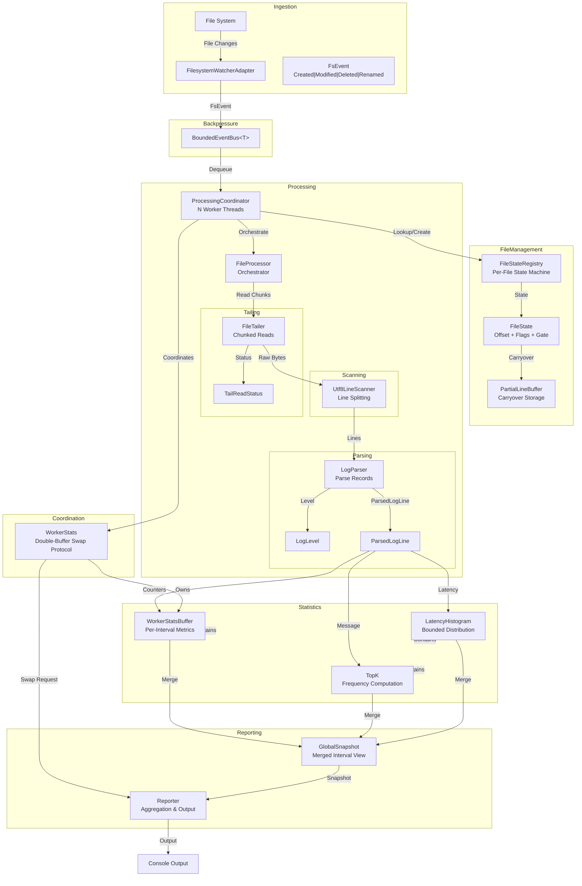

# LogWatcher

**Real-time log statistics for .NET without external dependencies.**

[](https://github.com/jvspeed74/LogWatcher/actions/workflows/ci.yml)
[](https://dotnet.microsoft.com/)
[](#license)


---

## Overview

LogWatcher watches a local directory for `.log` and `.txt` file activity and computes rolling statistics in real time. As files grow, it tails each one incrementally — reading only newly appended bytes — and parses every line for timestamp, log level, message type, and optional latency.

Every two seconds it prints a summary to the console:
- lines processed per second
- malformed line counts
- the most frequent message types
- latency percentiles (p50/p95/p99). 

It runs as a single self-contained process.

## Usage

```bash
dotnet run --project LogWatcher.App -- <watchPath> [options]
```

| Argument/Option         | Description                                      | Default    |
|-------------------------|--------------------------------------------------|------------|
| `watchPath`             | Directory path to watch for log file changes     | (required) |
| `--workers, -w`         | Number of worker threads for parallel processing | CPU count  |
| `--queue-capacity, -q`  | Maximum capacity of the filesystem event queue   | 10,000     |
| `--report-interval, -i` | Interval between console output (seconds)        | 2          |
| `--topk, -k`            | Number of most-frequent messages to track        | 10         |
| `--log-level, -l`       | Minimum log level for LogWatcher output (`Trace`, `Debug`, `Information`, `Warning`, `Error`, `Critical`) | `Warning` |

```bash
dotnet run --project LogWatcher.App -- ./logs --workers 8 --queue-capacity 50000 --report-interval 1
```

### Docker Compose

To run the application with a sample log generator using Docker Compose, use the following command:

```bash
docker compose up --build
```

---

[//]: # (TODO: Reorder sections for better readability.)

## Table of Contents
  * [Why This Exists](#why-this-exists)
  * [Design Decisions](#design-decisions)
  * [Invariants](#invariants)
  * [Architecture](#architecture)
  * [Documentation](#documentation)
  * [License](#license)

---

## Why This Exists

Built as a learning project alongside SAA-C03 preparation to develop hands-on intuition for system design tradeoffs —
specifically consistency models, backpressure, and memory management.

I wanted to see what patterns like bounded queues, decoupled producers and consumers, load shedding, and eventual
consistency actually look like in working code.

### Constraints

Before considering any design, I gave myself a set of constraints to force tradeoffs and guide decisions.

These were **intentionally restrictive** to encourage creativity and learning:

- **No external dependencies** — Only .NET built-in libraries; no third-party packages for parsing, metrics, or
  concurrency
- **Eventual consistency** — In-memory state may be temporarily stale or inconsistent across workers, but must
  converge to correctness over time without manual intervention
- **State must never be corrupted** — Handle data races and cross thread operations gracefully without crashing or
  losing consistency

---

[//]: # (TODO: Make this section more ingestible. It's a bit of a brain dump right now. Maybe split into subsections with diagrams? The goal is to explain the rationale behind the most important design decisions, so that when we inevitably revisit those decisions later we can understand the context and tradeoffs without having to re-derive them from scratch.)

## Design Decisions

**Per-file epoch system**

**Problem** — Workers track a byte offset per file path to read only newly appended content. When a file is deleted and recreated at the same path, that offset still exists in memory.

**Solution** — Each file path carries a generation counter that increments every time that path is finalized after a deletion. When a file reappears at the same path, the system treats it as a completely new file — the read position resets to zero and any buffered partial-line state from the previous file is discarded. The path is just a lookup key; the generation is what determines which file is actually being tracked at any given moment. (`FileStateRegistry`, `FileState`)

**Without this** — A recreated file inherits the previous file's read position. Content written at the beginning of the new file is silently skipped, or the worker seeks past end-of-file and reads nothing until the file grows beyond the stale offset.

---

**Span-based UTF-8 line scanner**

**Problem** — Log files are read in arbitrary chunks, so lines frequently split across read boundaries. Allocating a string or byte array per line on the hot path creates steady GC pressure at high throughput.

**Solution** — Rather than copying bytes into a new buffer for each line, the scanner works directly against the raw bytes already in memory from the last disk read. A line is just a description of where it starts and ends within that existing buffer — no allocation. When a line lands entirely within one chunk, it is handed to the caller as a zero-copy reference. When a line splits across two reads, only those boundary bytes are copied into a small carry buffer, which is prepended to the next chunk before scanning continues. The callback-based design (an `onLine` delegate rather than a return value) is a direct consequence of how C# handles these zero-copy references: they are only valid while the source buffer is live on the call stack, so they must be consumed immediately rather than collected and returned. (`Utf8LineScanner`, `PartialLineBuffer`)

**Without this** — Every log line produces at least one heap allocation, multiplied across potentially millions of lines per second. GC pauses grow proportional to throughput, directly degrading the latency measurements the tool is trying to report.

---

**Double-buffer swap protocol**

**Problem** — Workers continuously update per-interval statistics. If the reporter reads those stats directly, it must either lock the workers (blocking the hot path) or accept reading partially updated data.

**Solution** — Each worker maintains two separate stats buffers — one it actively writes to, and one that sits idle. When the reporter wants a snapshot, it signals that a swap is needed. Workers notice this at a controlled moment — after finishing a complete event, never mid-processing — and perform the swap themselves: they start writing to the freshly cleared buffer and hand the other one to the reporter. Because the handoff always happens at a known safe point and each side always owns a distinct buffer, neither the reporter nor the workers ever touch the same buffer simultaneously. No locking required. (`WorkerStats`, `WorkerStatsBuffer`)

**Without this** — Locking on every stat update serializes all workers against the reporter, turning a periodic 2-second operation into a recurring stall on every worker thread. Reading without a lock produces torn reads: histograms and counters written by different workers at different points in time.

---

**Dirty-flag catch-up loop**

**Problem** — Only one worker may process a given file at a time, enforced by a per-file gate. When a second worker receives a modify event for a file already being processed, it can't acquire the gate.

**Solution** — Rather than re-queuing the event (risks overflowing the bus) or dropping it (risks missing bytes), the blocked worker sets a "needs another pass" flag directly on the file's state record and moves on. The worker holding the processing lock checks this flag before releasing it. If the flag is set, that worker takes responsibility for the extra read — it clears the flag and processes the file again, repeating until no further passes are needed. The catch-up obligation travels with the lock rather than re-entering the event queue. (`FileState.IsDirty`, `ProcessingCoordinator`)

**Without this** — Under rapid write bursts, events arrive faster than a single worker can process them. Re-queuing fills the bus and triggers drops; dropping events directly means bytes are never read. The dirty flag makes the gate-holder responsible for catching up, decoupling event volume from processing completeness.

---

## Invariants

Concurrent code has a failure class that prose instructions can't reliably prevent: an agent or contributor sees a lock or a flag and removes it to simplify code, not understanding the race condition it prevents. The rule was written down, but without the semantic context for *why* it exists, it gets rationalized away. This kept happening during development with AI agents.

The response was to stop relying on instructions and make the rules machine-enforced. Every behavioral guarantee that crosses a component boundary — things like "at most one worker processes a given file at any point in time" or "once delete-pending is set it is never cleared" — was assigned a typed ID (`PROC-001`, `FM-002`). Every test that protects one of those guarantees is tagged `[Invariant("ID")]`. A dedicated coverage test (`InvariantCoverageTests.cs`) fails the build if any invariant ID has no tagged test.

The result: an agent that removes a lock doesn't violate a prose rule that might be misunderstood or overlooked — it breaks the build. No semantic understanding of the concurrency model required.

There are roughly 50 invariants across 10 domains. Not all correct behavior qualifies — only guarantees that cross component boundaries or describe system-wide safety properties. Invariants are typed by severity:

| Type | Violation means |
|---|---|
| `strict` | Data loss, corruption, or a crash |
| `behavioral` | Degraded but survivable behavior |
| `contract` | Caller and callee disagree on a shared assumption |
| `operational` | Only occurs under resource exhaustion or OS failure |

---

## Architecture



---

## Documentation

**Start here**
- [invariants.md](docs/invariants.md) — Every behavioral guarantee the system makes; IDs are enforced by tests. Read this before changing anything.
- [domain_boundaries.md](docs/domain_boundaries.md) — What each of the 12 domains owns and why; tells you where new code belongs.

**Reference when modifying specific subsystems**
- [concurrency_model.md](docs/concurrency_model.md) — Diagrams for every thread interaction, lock, and state machine.

**Background**
- [project_specification.md](docs/project_specification.md) — Non-technical overview of what the system does and why.
- [system_diagram.md](docs/system_diagram.md) — High-level architecture diagrams.
- [domain_definition.md](docs/domain_definition.md) — The theory behind what a "domain" is; context for domain_boundaries.md.

---

## License

MIT