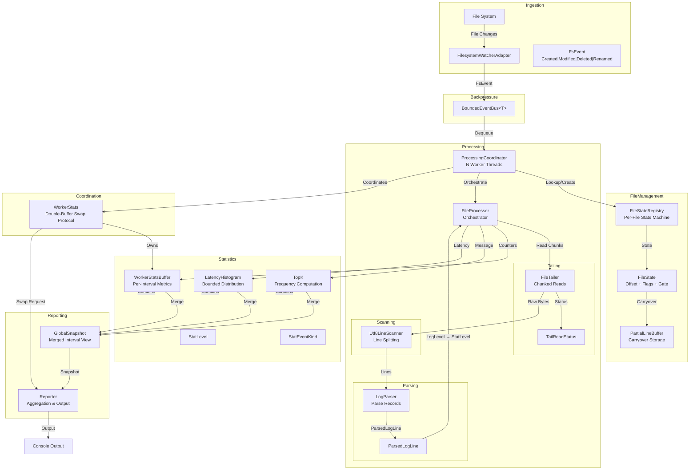

# LogWatcher

**Real-time log statistics for .NET without external dependencies.**

[](https://github.com/jvspeed74/LogWatcher/actions/workflows/ci.yml)
[](https://dotnet.microsoft.com/)
[](#license)

---

  * [Why This Exists](#why-this-exists)
  * [Architecture](#architecture)
  * [Functionality](#functionality)
  * [Usage](#usage)
  * [Documentation](#documentation)
  * [Machine-Enforced Invariants for Agentic Development in Concurrent Systems](#machine-enforced-invariants-for-agentic-development-in-concurrent-systems)
  * [License](#license)

---

## Why This Exists

Built as a learning project alongside SAA-C03 preparation to develop hands-on intuition for system design tradeoffs —
specifically consistency models, backpressure, and memory management.

I wanted to see what patterns like bounded queues, decoupled producers and consumers, load shedding, and eventual
consistency actually look like in working code.

### Constraints

Before considering any design, I gave myself a set of constraints to force tradeoffs and guide decisions.

These were **intentionally restrictive** to encourage creativity and learning:

- **No external dependencies** — Only .NET built-in libraries
- **Eventual consistency** — In-memory state may be temporarily stale or inconsistent across workers, but must
  converge to correctness over time without manual intervention
- **State must never be corrupted** — Handle data races and cross thread operations gracefully without crashing or
  losing consistency.
- **No managed thread pool** — Explicitly manage worker threads to force decisions around thread lifecycle,
  synchronization, and coordination.

---

## Architecture



---

## Functionality

LogWatcher watches a local directory for `.log` and `.txt` file activity and computes rolling statistics in real time.
As files grow, it tails each one incrementally — reading only newly appended bytes — and parses every line for
timestamp, log level, message type, and optional latency.

Every two seconds it prints a summary to the console:

- lines processed per second
- malformed line counts
- the most frequent message types
- latency percentiles (p50/p95/p99).

It runs as a single self-contained process.

---

## Usage

```bash
dotnet run --project LogWatcher.App -- <watchPath> [options]
```

| Argument/Option         | Description                                                                                               | Default    |
|-------------------------|-----------------------------------------------------------------------------------------------------------|------------|
| `watchPath`             | Directory path to watch for log file changes                                                              | (required) |
| `--workers, -w`         | Number of worker threads for parallel processing                                                          | CPU count  |
| `--queue-capacity, -q`  | Maximum capacity of the filesystem event queue                                                            | 10,000     |
| `--report-interval, -i` | Interval between console output (seconds)                                                                 | 2          |
| `--topk, -k`            | Number of most-frequent messages to track                                                                 | 10         |
| `--log-level, -l`       | Minimum log level for LogWatcher output (`Trace`, `Debug`, `Information`, `Warning`, `Error`, `Critical`) | `Warning`  |

```bash
dotnet run --project LogWatcher.App -- ./logs --workers 8 --queue-capacity 50000 --report-interval 1
```

### Docker Compose

To run the application with a sample log generator using Docker Compose, use the following command:

```bash
docker compose up --build
```

---

## Documentation

| Priority       | Document                                                       | Purpose                                                                                                        |
|----------------|----------------------------------------------------------------|----------------------------------------------------------------------------------------------------------------|
| **Start here** | [Invariants](docs/L5__LogWatcher__Invariants.md)               | Every architectural guarantee the system makes; IDs are enforced by tests. Read this before changing anything. |
| **Start here** | [Module Boundaries](docs/L5__LogWatcher__Module_Boundaries.md) | What each of the 12 domains owns and why; tells you where new code belongs.                                    |
| Reference      | [Concurrency Model](docs/concurrency_model.md)                 | Diagrams for every thread interaction, lock, and state machine.                                                |
| Background     | [Project Specification](docs/project_specification.md)         | Non-technical overview of what the system does and why.                                                        |
| Background     | [System Diagram](docs/system_diagram.md)                       | High-level architecture diagrams.                                                                              |
| Background     | [Module Definition](docs/module_definition.md)                 | The theory behind what a "domain" is; context for domain_boundaries.md.                                        |

---

## Machine-Enforced Invariants for Agentic Development in Concurrent Systems

Concurrent code has a failure class that prose instructions can't reliably prevent: an agent or contributor sees a lock
or a flag and removes it to simplify code, not understanding the race condition it prevents. The rule was written down,
but ignored or forgotten during implementation. This kept happening during development with AI agents.

The response was to stop relying on instructions and make the rules machine-enforced. Every behavioral guarantee that
crosses a component boundary — things like "at most one worker processes a given file at any point in time" or "once
delete-pending is set it is never cleared" — was assigned a typed ID (`PROC-001`, `FM-002`). Every test that protects
one of those guarantees is tagged `[Invariant("ID")]`. A dedicated coverage test (`InvariantCoverageTests.cs`) fails the
build if any invariant ID has no tagged test.

The result: an agent doesn't have to front-load all the micro-interactions in the system to make a safe change. They can
make the change, and if it violates an invariant, a test will fail and point them to the exact guarantee they broke.
This makes it much more feasible to use agents for development in concurrent systems, where the mental overhead of all
the interactions is a major barrier.

### What is a System Invariant?

A system invariant is an **architectural guarantee** — a property that crosses a component boundary or
describes a system-wide safety rule that multiple components depend on. They are not user-facing features or
implementation details, but rather the "rules of the road" that ensure the system behaves correctly under concurrency.

Invariants are typed by severity:

| Type | A violation means | Violation severity |
|---|---|---|
| `strict` | Data loss, corruption, or a crash | The system cannot continue correctly |
| `contract` | A shared assumption at a module boundary is broken — one side expects a condition the other does not satisfy | The interaction between two modules is incorrect, regardless of system state |
| `resource` | The module's implementation consumes a shared runtime resource in a pattern, or omits a structural property, that degrades the ambient environment other modules operate in — while the module's functional output remains correct | The shared environment (CPU, memory, scheduling) is degraded for modules with no declared relationship to the violating module |
| `behavioral` | Observable behavior degrades while the system remains operational | The system survives but delivers reduced guarantees |

The full definition can be found in [Invariant Definition](docs/invariant_definition.md), but examples include:

| ID       | Type         | Domains    | Description                                                                                                               |
|----------|--------------|------------|---------------------------------------------------------------------------------------------------------------------------|
| PROC-001 | `strict`     | PROC, FM   | At most one worker processes a given file path at any point in time.                                                      |
| SCAN-005 | `contract`   | SCAN, PROC | The span passed to `onLine` is only valid for the duration of the callback and must not be retained by the caller.        |
| PROC-008 | `resource`   | PROC     | No heap objects are allocated per line in the scan (`Utf8LineScanner.Scan`) and parse (`LogParser.TryParse`) steps. Statistics accumulation is excluded from this guarantee. |
| TAIL-004 | `behavioral` | TAIL       | File not found, access denied, and IO errors are mapped to status codes and never propagated as exceptions to the caller. |

---

## License

MIT