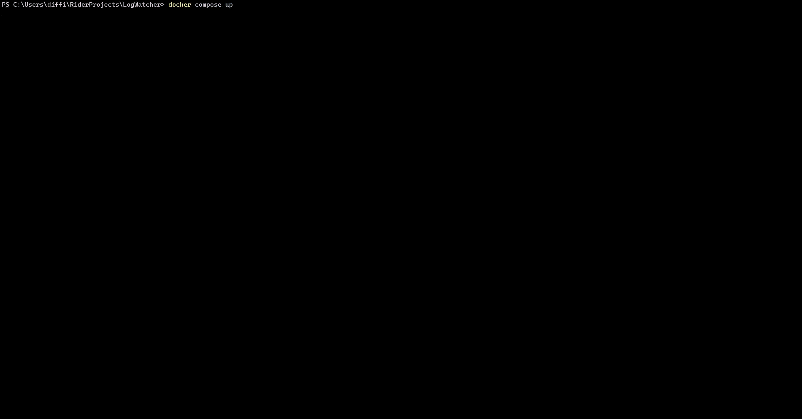
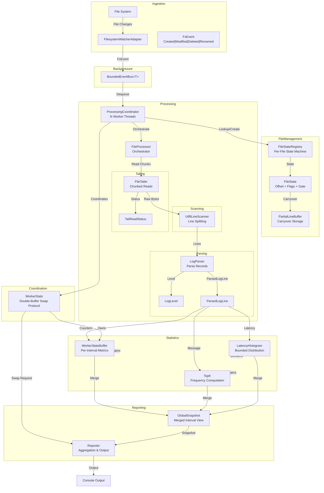

# LogWatcher

**Real-time log statistics for .NET without external dependencies.**

[](https://github.com/jvspeed74/LogWatcher/actions/workflows/ci.yml)
[](https://dotnet.microsoft.com/)
[](#license)



---

## Overview

LogWatcher watches a local directory for `.log` and `.txt` file activity and computes rolling statistics in real time. As files grow, it tails each one incrementally — reading only newly appended bytes — and parses every line for timestamp, log level, message type, and optional latency.

Every two seconds it prints a summary to the console:
- lines processed per second
- malformed line counts
- the most frequent message types
- latency percentiles (p50/p95/p99). 

It runs as a single self-contained process.

See [project_specification.md](docs/project_specification.md) for the non-technical specification of the system.

## Usage

```bash
dotnet run --project LogWatcher.App -- <watchPath> [options]
```

| Argument/Option         | Description                                      | Default    |
|-------------------------|--------------------------------------------------|------------|
| `watchPath`             | Directory path to watch for log file changes     | (required) |
| `--workers, -w`         | Number of worker threads for parallel processing | CPU count  |
| `--queue-capacity, -q`  | Maximum capacity of the filesystem event queue   | 10,000     |
| `--report-interval, -i` | Interval between console output (seconds)        | 2          |
| `--topk, -k`            | Number of most-frequent messages to track        | 10         |
| `--log-level, -l`       | Minimum log level for LogWatcher output (`Trace`, `Debug`, `Information`, `Warning`, `Error`, `Critical`) | `Warning` |

```bash
dotnet run --project LogWatcher.App -- ./logs --workers 8 --queue-capacity 50000 --report-interval 1
```

### Docker Compose

To run the application with a sample log generator using Docker Compose, use the following command:

```bash
docker compose up --build
```

## Why This Exists

Built as a learning project alongside SAA-C03 preparation to develop hands-on intuition for system design tradeoffs —
specifically consistency models, backpressure, and memory management.

I wanted to see what patterns like bounded queues, decoupled producers and consumers, load shedding, and eventual
consistency actually look like in working code.

### Constraints

Before considering any design, I gave myself a set of constraints to force tradeoffs and guide decisions.

These were **intentionally restrictive** to encourage creativity and learning:

- **No external dependencies** — Only .NET built-in libraries
- **Eventual consistency** — In-memory state may be temporarily stale or inconsistent across workers, but must
  converge to correctness over time without manual intervention
- **State must never be corrupted** — Handle data races and cross thread operations gracefully without crashing or
  losing consistency.
- **No managed thread pool** — Explicitly manage worker threads to force decisions around thread lifecycle, synchronization, and coordination.

---

## Architecture



---

## Machine-Enforced Invariants for Agentic Development in Concurrent Systems

Concurrent code has a failure class that prose instructions can't reliably prevent: an agent or contributor sees a lock or a flag and removes it to simplify code, not understanding the race condition it prevents. The rule was written down, but without the semantic context for *why* it exists, it gets rationalized away. This kept happening during development with AI agents.

The response was to stop relying on instructions and make the rules machine-enforced. Every behavioral guarantee that crosses a component boundary — things like "at most one worker processes a given file at any point in time" or "once delete-pending is set it is never cleared" — was assigned a typed ID (`PROC-001`, `FM-002`). Every test that protects one of those guarantees is tagged `[Invariant("ID")]`. A dedicated coverage test (`InvariantCoverageTests.cs`) fails the build if any invariant ID has no tagged test.

The result: an agent that removes a lock doesn't violate a prose rule that might be misunderstood or overlooked — it breaks the build. No semantic understanding of the concurrency model required.

There are roughly 50 invariants across 10 domains. 

Invariants are typed by severity:

| Type | Violation means |
|---|---|
| `strict` | Data loss, corruption, or a crash |
| `behavioral` | Degraded but survivable behavior |
| `contract` | Caller and callee disagree on a shared assumption |
| `operational` | Only occurs under resource exhaustion or OS failure |

See [invariants.md](docs/invariants.md) and [domain_boundaries](docs/domain_boundaries.md) for more info.

---

## Documentation

**Start here**
- [invariants.md](docs/invariants.md) — Every behavioral guarantee the system makes; IDs are enforced by tests. Read this before changing anything.
- [domain_boundaries.md](docs/domain_boundaries.md) — What each of the 12 domains owns and why; tells you where new code belongs.

**Reference when modifying specific subsystems**
- [concurrency_model.md](docs/concurrency_model.md) — Diagrams for every thread interaction, lock, and state machine.

**Background**
- [project_specification.md](docs/project_specification.md) — Non-technical overview of what the system does and why.
- [system_diagram.md](docs/system_diagram.md) — High-level architecture diagrams.
- [domain_definition.md](docs/domain_definition.md) — The theory behind what a "domain" is; context for domain_boundaries.md.

---

## License

MIT