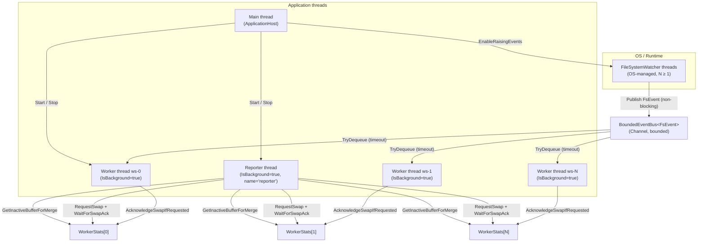
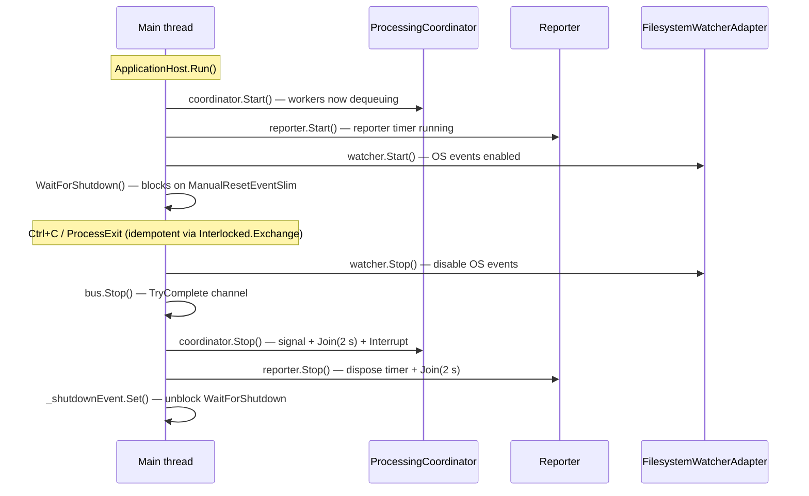
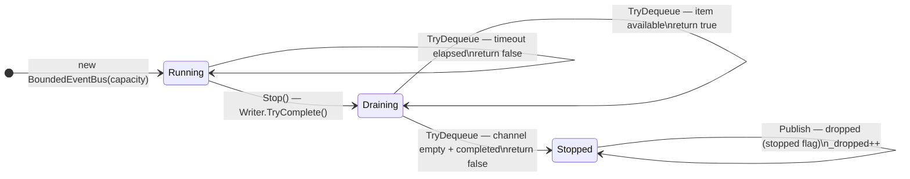
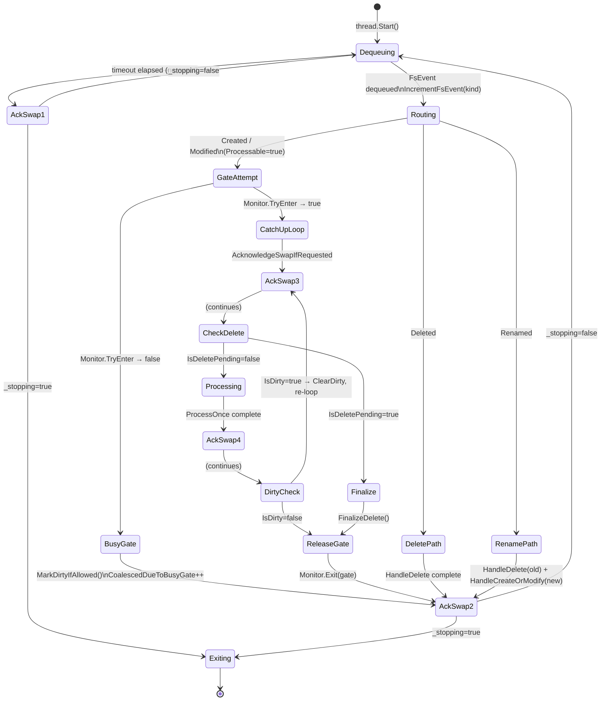
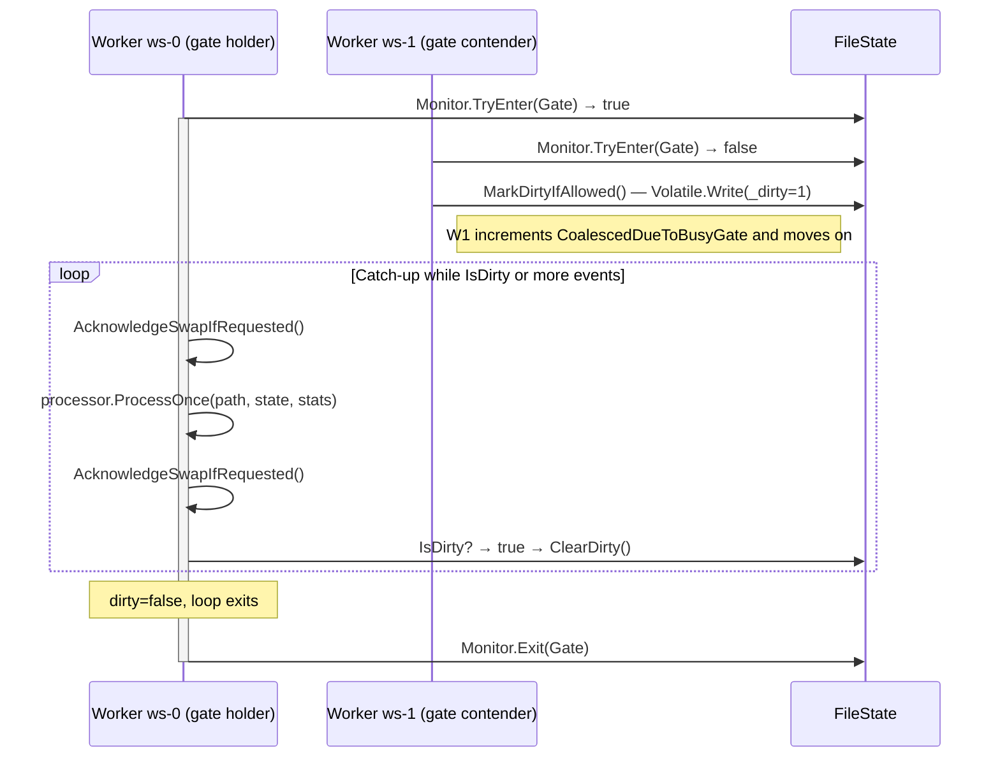
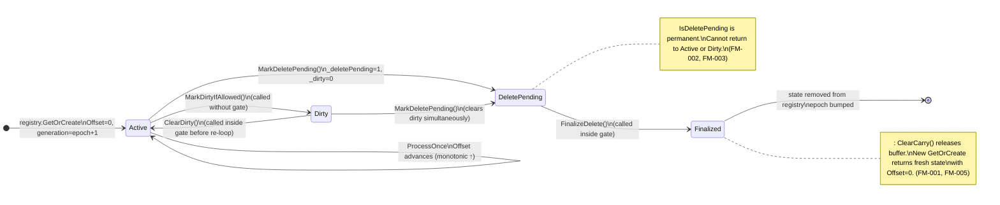
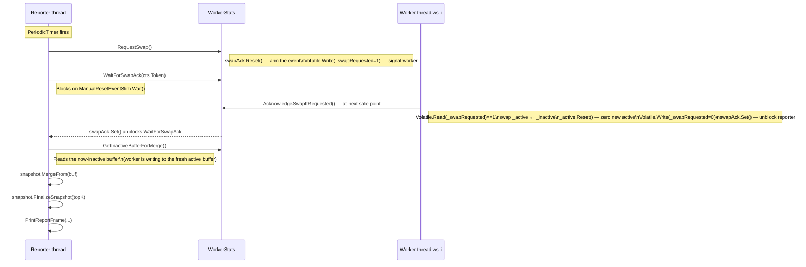
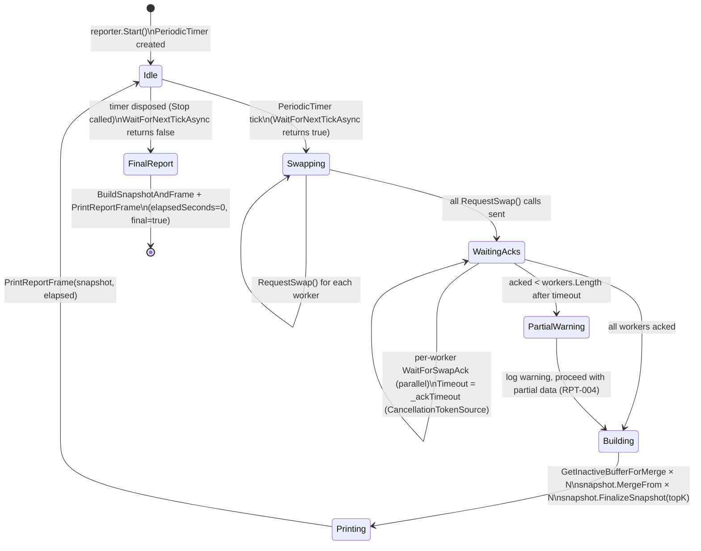

# Concurrency Model

This document provides detailed Mermaid diagrams for every thread, synchronization primitive, and
state machine in LogWatcher. For the authoritative component descriptions see
[technical_specification.md](technical_specification.md), and for behavioural guarantees see
[invariants.md](invariants.md).

---

## 1 — Thread Overview

Four categories of threads cooperate to process log files without blocking any producer.



### Startup and shutdown order

Startup and shutdown follow strict orderings (invariants **HOST-001** / **HOST-003**).



---

## 2 — BoundedEventBus State Machine

The bus wraps a `Channel<T>` with drop-newest backpressure. It is the only shared data
structure touched by both watcher threads and worker threads.



**Key invariants**: BP-001 (capacity never exceeded), BP-002 (drop-newest), BP-005 (consumers drain before stop), BP-006 (publishers never block).

---

## 3 — Worker Thread Lifecycle

Each worker (`ws-0 … ws-N`) runs the same loop. The only differences are which `WorkerStats`
slot it owns.



---

## 4 — Per-File Gate and Dirty-Flag Protocol

Each `FileState` owns a plain `object Gate`. `Monitor.TryEnter` provides non-blocking
mutual exclusion. If the gate is busy the worker sets `IsDirty` and moves on; the gate-holder
loops until dirty is clear before releasing (**PROC-001 … PROC-003**).



---

## 5 — FileState Lifecycle State Machine



**Field transitions**:

| Field | Direction | Guard |
|---|---|---|
| `Offset` | 0 → ∞ (monotonic) | Must hold Gate |
| `IsDirty` | false ↔ true | Read: Volatile; Write: without gate OK |
| `IsDeletePending` | false → true (irreversible) | Write: without gate OK; see FM-002 |

---

## 6 — Double-Buffer Swap Protocol

Each `WorkerStats` owns two `WorkerStatsBuffer` instances and one `ManualResetEventSlim`.
The reporter drives swaps; workers acknowledge at safe points.



**State of the two buffers over time**:

```mermaid
stateDiagram-v2
    direction LR

    [*] --> NormalA : WorkerStats constructed\nA=active, B=inactive

    NormalA --> SwapRequested : Reporter calls RequestSwap()\nswapAck.Reset(); _swapRequested=1
    SwapRequested --> NormalB  : Worker acks:\nA↔B swapped; A.Reset(); swapAck.Set()
    NormalB --> SwapRequested  : Reporter calls RequestSwap() again
    SwapRequested --> NormalA  : Worker acks:\nB↔A swapped; B.Reset(); swapAck.Set()

    note right of SwapRequested : Reporter is blocked in WaitForSwapAck.\nWorker continues processing on old active.\nSwap happens at next safe point only.
```



**Safe points for `AcknowledgeSwapIfRequested`** (every worker, per loop iteration):

1. After `TryDequeue` timeout (no event received)
2. After routing and handling a full event
3. Before each `ProcessOnce` call (inside gate, top of catch-up loop)
4. After each `ProcessOnce` call (inside gate, bottom of catch-up loop)

---

## 7 — Reporter Thread Lifecycle



---

## 8 — Application Shutdown State Machine

Shutdown is triggered by `Ctrl+C` or `ProcessExit`. An `Interlocked.Exchange` guard makes it idempotent (**HOST-002**).

```mermaid
stateDiagram-v2
    direction TB

    [*]          --> Running      : ApplicationHost.Run()

    Running      --> ShutdownOnce : Ctrl+C or ProcessExit\nInterlocked.Exchange(ref _shutdownRequested, 1)==0

    Running      --> Running      : Ctrl+C or ProcessExit\nInterlocked.Exchange returns 1\n(already shutting down — ignored)

    ShutdownOnce --> StopWatcher  : (begin ordered teardown)
    StopWatcher  --> StopBus      : watcher.Stop() — DisableRaisingEvents
    StopBus      --> StopWorkers  : bus.Stop() — Writer.TryComplete()
    StopWorkers  --> StopReporter : coordinator.Stop()\n  Volatile.Write(_stopping=true)\n  foreach Join(2 s) or Interrupt
    StopReporter --> Finished     : reporter.Stop()\n  timer.Dispose(); Join(2 s)
    Finished     --> [*]          : _shutdownEvent.Set() — unblocks main thread
```



---

## 9 — Full End-to-End Event Flow

A single file-modification event travelling through all layers:

```mermaid
sequenceDiagram
    participant FS  as Filesystem
    participant WTA as WatcherThread (OS)
    participant BUS as BoundedEventBus
    participant WT  as Worker ws-0
    participant REG as FileStateRegistry
    participant FST as FileState (Gate)
    participant FP  as FileProcessor
    participant WS  as WorkerStats[0]
    participant RT  as Reporter thread

    FS->>WTA: File written
    WTA->>BUS: Publish(Modified, path)\nTryWrite → _published++
    Note right of BUS: If full: _dropped++, event silently discarded (BP-002)

    BUS-->>WT: TryDequeue(200 ms) → FsEvent
    WT->>WS: Active.IncrementFsEvent(Modified)
    WT->>REG: GetOrCreate(path) → FileState
    WT->>FST: Monitor.TryEnter(Gate)

    alt Gate free
        WT->>WS: AcknowledgeSwapIfRequested()
        WT->>FP: ProcessOnce(path, state, activeBuffer)
        FP->>FP: FileTailer.ReadAppended → bytes
        FP->>FP: Utf8LineScanner.Scan → lines
        FP->>FP: LogParser.TryParse → LogRecord
        FP->>WS: IncrementLevel / IncrementMessage / RecordLatency
        FP->>FST: state.Offset += bytesRead
        WT->>WS: AcknowledgeSwapIfRequested()
        WT->>FST: IsDirty? → false → break loop
        WT->>FST: Monitor.Exit(Gate)
    else Gate busy (another worker holds it)
        WT->>FST: MarkDirtyIfAllowed() — _dirty=1
        WT->>WS: CoalescedDueToBusyGate++
        Note right of WT: Gate holder will re-process\ndue to dirty flag
    end

    WT->>WS: AcknowledgeSwapIfRequested()

    Note over RT: PeriodicTimer fires (e.g., every 2 s)
    RT->>WS: RequestSwap()
    WS-->>WT: _swapRequested=1 visible at next safe point
    WT->>WS: Swap A↔B; A.Reset(); swapAck.Set()
    RT->>WS: WaitForSwapAck returns
    RT->>WS: GetInactiveBufferForMerge() → bufferB
    RT->>RT: snapshot.MergeFrom(bufferB)
    RT->>RT: FinalizeSnapshot → TopK + percentiles
    RT->>RT: PrintReportFrame to stdout
```

---

## 10 — Concurrency Primitives Reference

| Primitive | Where used | Purpose |
|---|---|---|
| `Channel<T>` (bounded) | `BoundedEventBus` | Lock-free producer/consumer queue with bounded capacity |
| `Volatile.Read/Write` | `_stopping`, `_dirty`, `_deletePending`, `_swapRequested`, `_stopped` | Lightweight cross-thread flag visibility without locks |
| `Interlocked.Increment` | `_published`, `_dropped`, `_errorCount` | Atomic counter updates |
| `Interlocked.Exchange` | `_shutdownRequested` | Idempotent one-shot check-and-set |
| `Monitor.TryEnter` + `finally` | `FileState.Gate` in coordinator | Non-blocking per-file mutual exclusion |
| `ManualResetEventSlim` | `WorkerStats._swapAck` | Worker → Reporter acknowledgement signal |
| `PeriodicTimer` | `Reporter` | Allocation-free periodic wake-up |
| `CancellationTokenSource` | Dequeue timeout, swap ack timeout | Bounded waits |
| `Parallel.ForEach` | Reporter swap-ack phase | Wait for all workers in parallel |
| `Thread.Join` + `Thread.Interrupt` | Shutdown | Bounded thread termination |
| `ConcurrentDictionary` | `FileStateRegistry` | Thread-safe path → state map |
